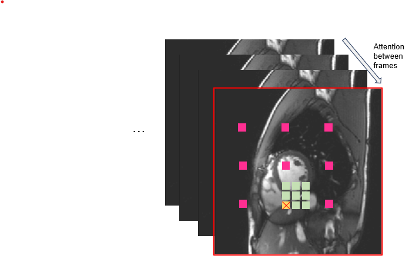
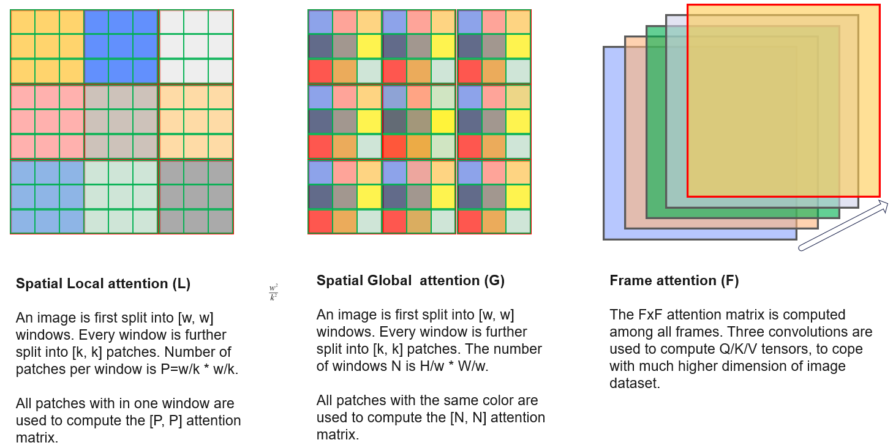

# Attention layers

Given the 5D tensor, different imaging attention modules are developed to capture the signal correlation across spatial and frame/temporal dimensions. All these modules receive a 5D tensor and output a 5D tensor. Unlike the token based attention, these imaging attention modules do not convert pixel data to tokens. That is, the computation is performed in the pixel space, not in token space.

Full attention across three dimensions (F, H, W) can incur high computing costs and may not be optimal as the locality of information was not exploited. Instead, intra- and inter-frame attention can be separately computed. For spatial (along with H, W) attention, a target patch (marked in yellow) takes in information from both close neighbors (marked in green) and remote patches (marked in pink). 

Let the image size be $[H, W]$, the windows size be $[w, w]$ and patch size be $[k, k]$. The number of windows will be $[\frac {H}{w}, \frac{W}{w}]$. The number of patches is $[\frac{H}{k}, \frac{W}{k}]$. For example, for an $256 \times 256$ images, $w=32$ and $k=16$, we will have $8 \times 8$ windows and each window will have $2 \times 2$ patches.

**Spatial Local attention (L)** 

Local attention is computed by attending to the all patches in a window for images or feature maps. The attention matrix is $\frac {w}{k} \times \frac {w}{k}$.

**Spatial Global attention (G)**

While the local attention only explores neighboring pixels, global attention looks at more remote pixels. This will help model learn global information over larger field-of-view. All patches with the same color are attended together. So for every patch, attention matrix size is $w^2 \times w^2$ (that is, the number of windows). 

**Frame or temporal attention (F)**

All frames can attend each other to compute the output values. In this case, the attention matrix size is ${F}\times{F}$.

These **F, G, T** attention mechanisms are implemented as **Attention** modules. The implemented version supports multi-heads.

**Spatial Local 3d attention** 

Previous spatial local attention works on every 2D frame independently. For some applications where data acquisition is 3D, it may require to perform 3D attention. In this case, the [F, H, W] volume is split into 3D windows. Every window includes 3D patches. All patches within a window are attended together.

**Spatial Global 3d attention**

Similar to the 2D global attention, the tensor is split to 3D windows and patches. Corresponding patches from all windows attend each other.

## Other attentions

**Spatial ViT attention** 

The vision transformer method splits the image into windows. All pixels in a window are flattened into a feature vector. Features from all windows are inputted into the attention. This layer works on every 2D frame, as the spatial local attention.

**ViT 3d attention** 

The image is split to 3D window to compute the attention.

**Swin 3d attention**

The shifted window attention is adapted to 3D. The image is split to 3D windows. Every 3d window is split to 3D patches. The attention is computed among all patches within a window or a shifted window. 

