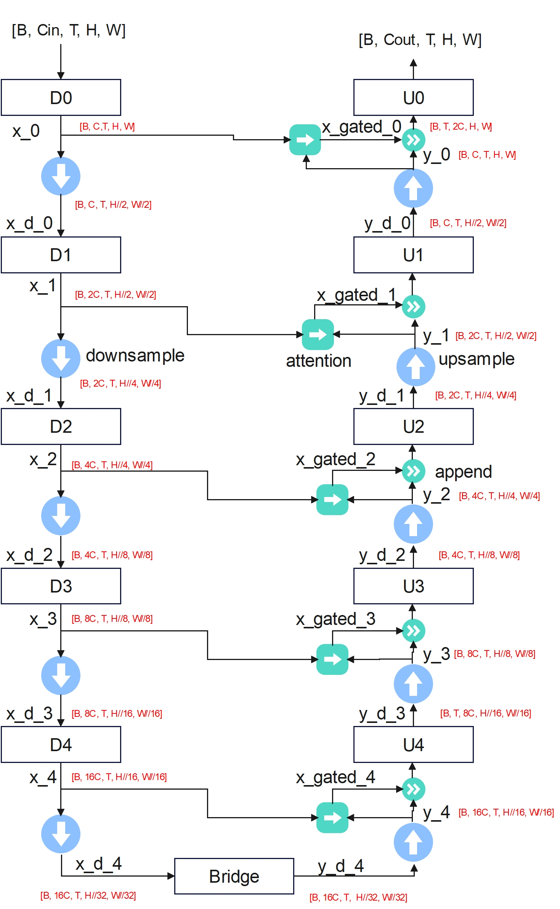
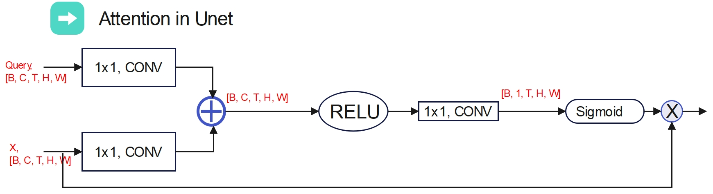
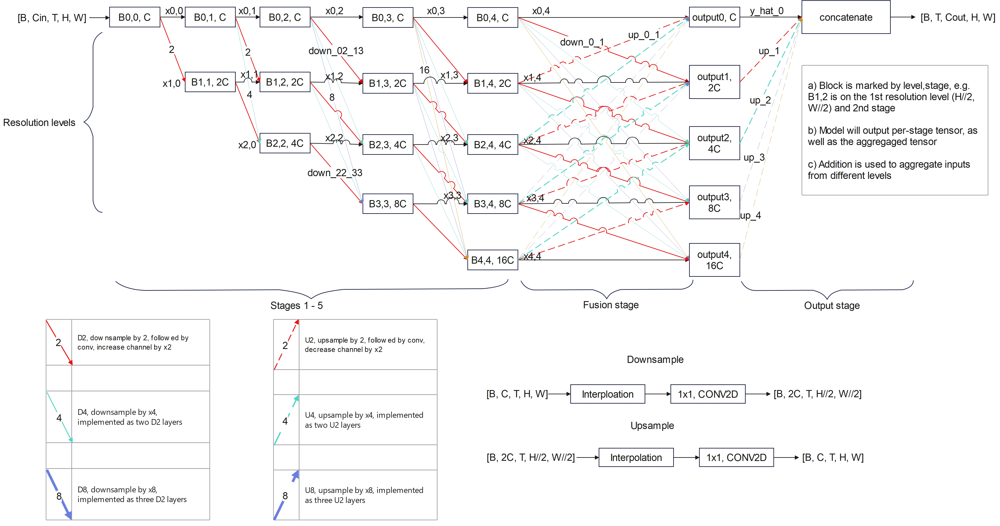
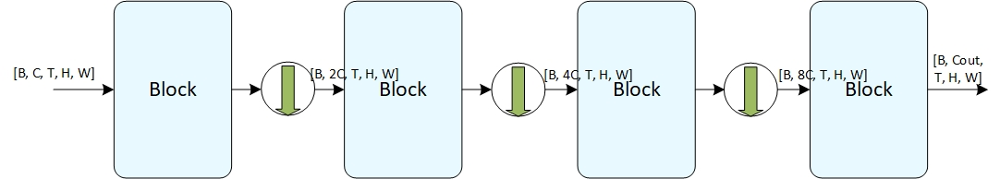

# Backbone

Attention - Cell - Block are three levels of building blocks for a model. We can connect many blocks to assemble a backbone. Here the backbone means an "almost" full model. Different pre- and post-processing task heads can be added to a backbone, given a specific application. 

In the LLMs, the stack of attentions proves to be very effective. For imaging, previous researches had explored similar architecture (e.g. [3B swin v2](https://arxiv.org/abs/2111.09883) and [20B ViT](https://arxiv.org/abs/2302.05442)). On the other hand, there are very intuitive model architectures were invented for different convolution models. Comparing to the LLM type backbone, these CNN derived architectures are more tuned for image data format, by utilizing resolution pyramid, up and downsampling, and long range skip connections. 

Different backbone models are implemented by borrowing successful architectures from CNNs.

### backbone U-Net

Here every resolution stage includes one block containing multiple cells. Model can specify number of feature maps (Channel dimension C) at each resolution stage. 

Return tensor of this backbone is the final output tensor after U0 layer.

The [Unet with attention](https://arxiv.org/abs/1804.03999) is implemented here. Downsample and upsample are implemented with interpolation.

### backbone HR-Net

This network is modified from the [high-resolution architecture](https://www.microsoft.com/en-us/research/blog/high-resolution-network-a-universal-neural-architecture-for-visual-recognition/).

The network is defined as levels and stages. Every block is numbered by its level and stage indexes (starting from 0). The downsample and upsample modules are added to link different blocks. Different up/downsample modules are implemented, with TLG attentions or 1x1 CONV. Bilinear interpolation is used to alter spatial resolution.

After the fusion stage, the model outputs per-level tensors and the aggregated tensor as a list. This backbone returns a list of tensors. The outputs from every resolution level and the final aggregated tensor are returned as a list *res*. *res[0]* is the output with the highest resolution (*y_hat_0*). *res[1]* is the *y_hat_1* etc. The *res[-1]* is the aggregated tensor.

### backbone Stack-of-attention (SOANet)

The classical stack-of-attention model is defined by the stages. Each stage contains one block with many cells. The downsampling layers are optional between stages.

We can instantiate the typical Swin or ViT model by inserting corresponding cells to SOANet. For example, a four-stage model with block strings ["S3ShS3Sh", "S3ShS3Sh", "S3ShS3ShS3ShS3ShS3ShS3Sh", "S3ShS3Sh"] is a replica of published model in the [swin paper](https://arxiv.org/abs/2103.14030).A one stage model ["V2V2V2V2V2V2V2V2V2V2V2V2"] is a version of 2D ViT base model with 12 cells. Since the backbone takes in the 5D tensor, it is often better to instantiate 3D ViT model, e.g. ["V3V3V3","V3V3V3V3V3V3", "V3V3V3V3V3V3V3V3V3V3V3V3"] for a 3 stage 3D ViT.

This backbone returns a list of tensors containing outputs from all stages. *res[0]* is the first stage and *res[-1]* has the lowest resolution (if downsampling).

**Please ref to [examples and tests](./examples_and_tests.md) for how to instantiate the backbone.**