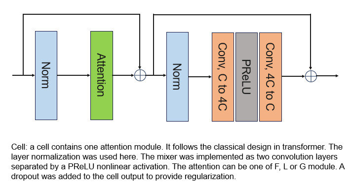
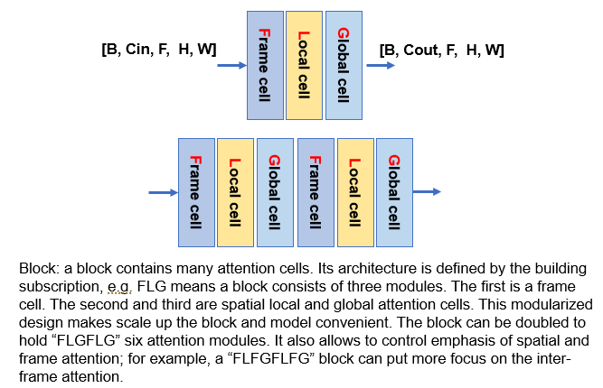
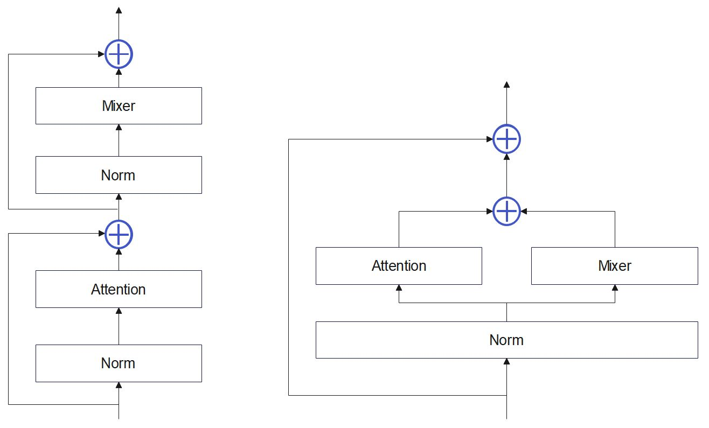

# Cell and Block

## Cell
A cell is a container to host an attention layer, as the basic processing unit for the 5D tensor. As the following, a cell can host either F, L or G or other attentions. Input tensor goes through the norm layers and attention. The mixer consists of another norm and two convolutions. 



Many attention modules are supported. These modules are represented by its name string:

| Name | Description |
| ----------- | ----------- |
| V2 | 2D ViT attention, working on [H, W], with the mixer |
| V3 | 3D ViT attention, working on [D/Z/T, H, W], with the mixer |
| L1 | spatial local attention on [H, W], with mixer |
| L0 | spatial local attention on [H, W], without mixer |
| L3 | local 3D attention on [D/Z/T, H, W], with mixer |
| G1 | spatial global attention on [H, W], with mixer |
| G0 | spatial global attention on [H, W], without mixer |
| G3 | global 3D attention on [D/Z/T, H, W], with mixer |
| S3 | swin 3D attention over [D/Z/T, H, W], with the mixer|
| Sh | swin 3D attention over [D/Z/T, H, W], with the mixer, shifted window|

#### Norms

Different $Norm$ can be configured: 

| Norm | Description |
| ----------- | ----------- |
| LayerNorm | normalize over [C, H, W] |
| BatchNorm 2D | normalize over [H, W], B*T are batch dimension |
| BatchNorm 3D | normalize over [T, H, W] |
| InstanceNorm 2D | normalize over [H, W]|
| InstanceNorm 3D | normalize over [T, H, W]|

Except the *layer* norm, all other norms support flexible image sizes, when using with the $CONV$ in attention layers.

#### Mixers

The mixers are added after attention layers to increase model power. Two types of mixers are implemented. *Linear* mixer are the same mixer type used in the conventional transformer, with `torch.linear` layers. The "conv" mixer replaced Linear layer with the convolution layer, to better fit for imaging tensors. The conv is performed along the $[C, H, W]$:

```
self.mlp = nn.Sequential(
                Conv2DExt(C_out, 4*C_out, kernel_size=kernel_size, stride=stride, padding=padding, bias=True),
                nn.GELU(),
                Conv2DExt(4*C_out, C_out, kernel_size=kernel_size, stride=stride, padding=padding, bias=True),
                nn.Dropout(dropout_p),
            )
```

User can specify whether a cell has mixer or not.

## Block

Many cells are concatenated to enhance the model power. To standardize this configuration, the Block is introduced:



A block contains any number of cells and can be scaled up by inserting more cells. 

A block is coded by the acronyms of attention layers in each cell. For example, a block is coded as the block string "L1G1T1". The letter "L", "G" or "T" means the local, global and Frame/Temporal Cell. "1" means the mixer is added on top of the attention mechanism (if "0", mixer is not added; we can have a stack of attention only layers). As an example, "L0L1G0G1T1" means a block with 5 attention layers. Mixers are not added to the first and third attentions, but added after the second and fourth attentions. The last cell is a temporal attention with its mixer added. This method of "block string specification" gives a good amount of flexibility to assemble and test different attention configurations. Depending on the image resolutions and number of feature maps, different blocks in a model can have different attention configuration. Note the convolution layers are formatted into this framework as the "C2" or "C3" cells. "C2" means the 2D conv is used in the cell. "C3" means the 3D conv is used (over F, H, W). By changing the block string from attentions to convs, we can get identical architectures with only differences being the cell structure. 

The block string can also be "S2" or "S3" for 2D or 3D SWIN module. Each SWIN module includes two parts for concatenated normal and shifted window attentions. These attention modules can be concatenated in any order of mixing. For example, *L1G1T1* or *S3V2L1G1T1*, or *G1G3S3V2T1* etc. *S3ShS3ShS3Sh* is the SWIN transformer with normal and shifted window attentions interleaved. *V3V3V3V3* is the ViT transformer. By separating the backbone architecture with attention modules, it is very flexible to instantiate many types of models, tailored to the nature of datasets and amount of computing. 

Two cell layouts were implemented: sequential and parallel:



The reference for parallel cell is [here](https://arxiv.org/abs/2302.05442). 