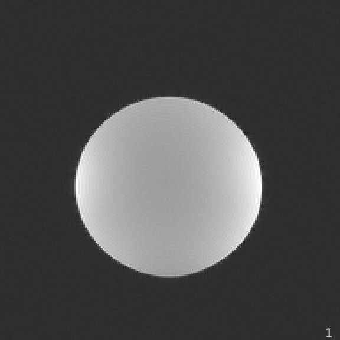
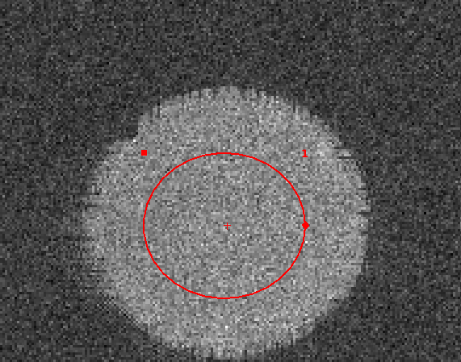
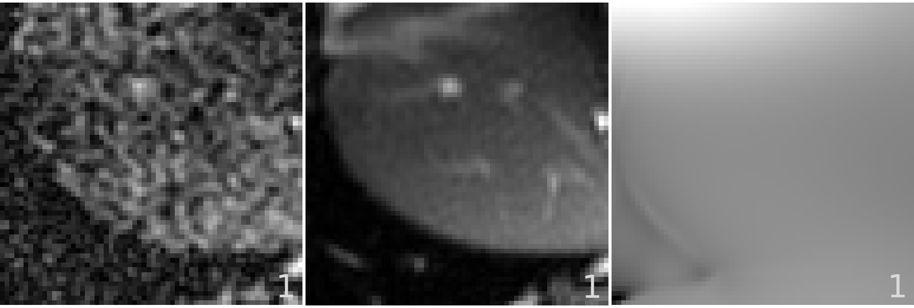
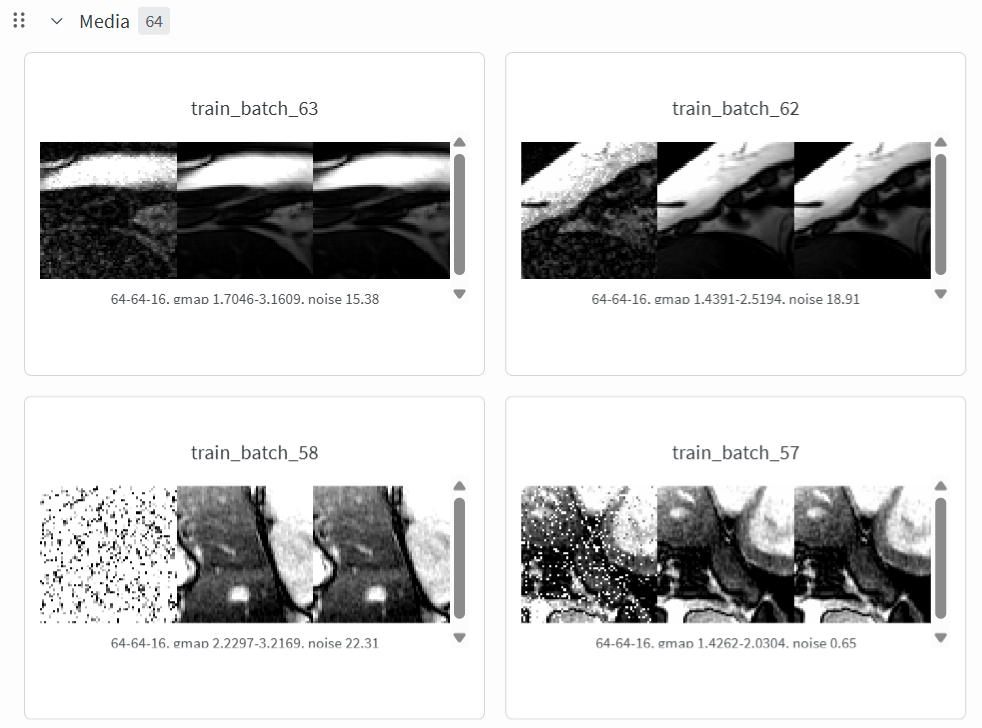

# MRI Denoising with SNRUnit

## SNRUnit

Central to our MRI model is the concept of signal-to-noise ratio (SNR) and unitary noise level. When the noise level is statistically 1.0 (aka unitary), image intensity directly reflects pixel-wise SNR. This fixed noise floor helps the model distinguish signal from noise. To demonstrate, we scanned a water phantom 40 times:



The per-pixel noise standard deviation (SD) is estimated as `std = np.std(im, axis=2)`, where `im` is the image tensor `[H, W, T]`. The SNRUnit scheme ensures the mean noise level (measured by averaging the SD inside the circle) is 1.0. The mean SD can be measured by drawing a region-of-interest and computing the mean:



The mean SD measured is 1.01.

A set of functions are developed to simulate colored noise in MR imaging. The simulated noise is added to the clean images to generate paired low- and high-quality samples. These functions are carefully validated to maintain a unitary noise level. The corresponding code is located in the `src/snraware/projects/mri/snr` folder, with unit tests in [`test/test_snr_noise.py`](../test/test_snr_noise.py).

## Denoising

The SNRAware method is applied to MRI denoising. Correlated MR noise is generated and added to high-quality complex images. The imaging transformer model is instantiated to predict the high quality output. 

In the visualization below, the left panel shows the generated noisy sample, the middle panel displays the ground-truth high-quality data, and the right panel presents the g-factor map.


A set of imaging loss functions are implemented in `src/snraware/projects/loss/imaging_loss.py`. Different combination of losses can be configured to train the model. To use these loss functions, simply import from imaging_loss, e.g. `from snraware.projects.loss.imaging_loss import SSIM_loss`.

The project source files reside in `src/snraware/projects/mri/denoising`. The main driver file is `run.py`. To start a training: 
```bash
python3 ./src/snraware/projects/mri/denoising/run.py logging.use_wandb=True trainer.max_epochs=32 batch_size=1
```

To train the release small and medium models:
```bash
# a small model, 27.7 M parameters
python3 ./src/ifm/mri/denoising/run.py logging.use_wandb=True backbone.block_str=\[\'T1L1G1\',\ \'T1L1G1\'\] trainer.max_epochs=320

# a medium model, 55.1 M parameters
python3 ./src/ifm/mri/denoising/run.py logging.use_wandb=True backbone.block_str=\[\'T1L1G1T1L1G1\',\ \'T1L1G1T1L1G1\'\] trainer.max_epochs=320

# a large model, 109 M parameters
python3 ./src/ifm/mri/denoising/run.py logging.use_wandb=True backbone.block_str=\[\'T1L1G1T1L1G1T1L1G1T1L1G1\',\ \'T1L1G1T1L1G1T1L1G1T1L1G1\'\] trainer.max_epochs=320
```

User needs to log into the wandb as `wandb login`. Training and validation samples will be uploaded to wandb as videos. 


# Run inference

After training the model, user can run inference with `run_inference.py` in the `src/snraware/projects/mri/denoising` folder. Examples to run the model inference is given in the [README](../README.md).